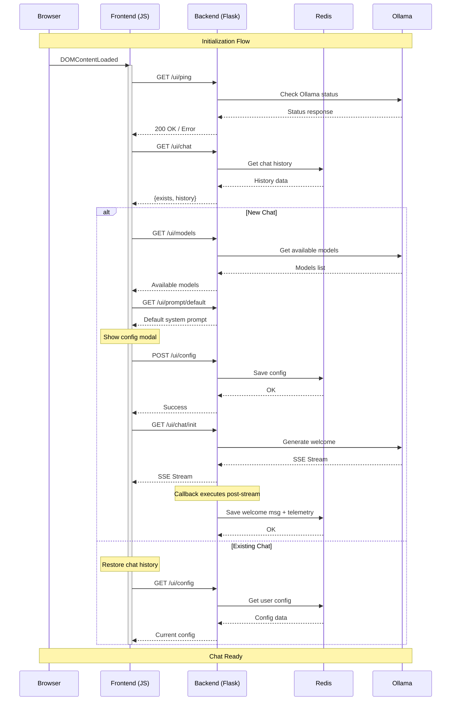

# LLM-2000 Developer Documentation

## Service Architecture

### LLMService

The `LLMService` class handles direct interactions with the Ollama API. It provides a clean interface for making requests to local LLM models while handling configuration, validation, and error cases.

#### Key Features

- **Model Management**: Validates model availability and status
- **Request Configuration**: Handles temperature, top_p, and context settings
- **Streaming Support**: Provides both streaming and synchronous responses
- **Error Handling**: Comprehensive error handling for API interactions

#### Main Methods

```python
class LLMService:
    def __init__(self, model: str, prompt: str = None):
        """Initialize with model name and optional system prompt."""

    @classmethod
    def get_available_models(cls):
        """Fetch list of available models from Ollama."""

    @classmethod
    def check_ollama_status(cls):
        """Validate Ollama is running and has models available."""

    def generate_response_stream(self, messages):
        """Generate streaming response for chat messages."""

    def generate_response_sync(self, messages):
        """Generate synchronous response for chat messages."""
```

#### Configuration

The service uses the following configuration from `config.py`:
- `OLLAMA_TEMPERATURE`: Controls response randomness (default: 0.8)
- `OLLAMA_TOP_P`: Controls response diversity (default: 0.9)
- `OLLAMA_NUM_PREDICT`: Maximum tokens to generate (default: 512)
- `OLLAMA_NUM_CTX`: Context window size (default: 4096)
- `OLLAMA_HOST`: Ollama API endpoint

### ChatService

The `ChatService` architecture provides a flexible system for handling chat interactions, with both stateful and stateless implementations. The architecture uses a **callback-based approach** for streaming responses to maintain clean separation of concerns.

#### Base ChatService

The base `ChatService` class defines the core interface and common functionality:
- Initializes LLM interactions
- Provides message processing methods
- Handles streaming responses

#### StatelessChatService

A minimal implementation for stateless API interactions:
- No persistence
- Direct pass-through to LLM
- Suitable for simple API integrations

#### StatefulChatService

Full-featured implementation with state management and callback-based streaming:

```python
class StatefulChatService(ChatService):
    def __init__(self, user):
        """Initialize with user context and load existing state."""

    def clear_history(self):
        """Clear chat history for current user."""

    def _add_message(self, content, role):
        """Private method to add and persist a new message."""

    def set_config(self, model=None, prompt=None):
        """Update user-specific configuration with validation."""

    def process_message_stream(self, message_content):
        """Process message and return streaming response with cleanup callback.
        
        Returns:
            tuple: (requests.Response, cleanup_callback)
        """

    def get_welcome_message_stream(self):
        """Get initial welcome message stream with cleanup callback.
        
        Returns:
            tuple: (requests.Response, cleanup_callback)
        """

    def _create_cleanup_callback(self, input_messages):
        """Create cleanup callback for post-stream processing."""
```

#### Callback Architecture

The streaming methods now use a **callback-based architecture** that provides better encapsulation:

1. **Streaming Methods Return Tuples**: Methods like `process_message_stream()` return both the streaming response and a cleanup callback
2. **Encapsulated Cleanup Logic**: All post-stream processing (persistence, telemetry) is encapsulated in callbacks
3. **Clean Separation**: Route handlers only manage HTTP streaming, services handle business logic
4. **Better Testability**: Each callback is self-contained and testable

**Callback Flow**:
```python
# Service creates callback with all necessary context
def _create_cleanup_callback(self, input_messages):
    def cleanup_callback(complete_response):
        # Handle LLM observability telemetry
        with LLMObs.llm(model_name=self.config['model']) as span:
            LLMObs.annotate(span, input_data=input_messages, 
                          output_data={"role": "assistant", "content": complete_response})
        # Persist the response
        self._add_message(complete_response, "assistant")
    return cleanup_callback

# Route handler just executes callback when streaming completes
response, cleanup_callback = chat_service.process_message_stream(message)
# ... after streaming completes ...
cleanup_callback(complete_response)
```

#### Data Storage

The service uses Redis for persistence with the following key patterns:
- `chat_history:{user_id}`: JSON-encoded list of chat messages
- `chat_config:{user_id}`: Hash of user-specific configuration (model, prompt)

#### Enhanced Validation

The service now includes comprehensive input validation:
- **Model Validation**: Empty models are rejected with clear error messages
- **Consistent Validation**: Same validation rules applied in both `create()` and `set_config()` methods
- **Prompt Handling**: Empty prompts are allowed (no system prompt scenario)

## Routes

### Chat Routes (`/app/routes/chat.py`)

The chat routes have been significantly simplified through the callback architecture, removing tight coupling between route handlers and service internals.

#### Streaming Response Handler

```python
def create_sse_response(response, cleanup_callback=None):
    """Create SSE response with optional cleanup callback execution."""
    # Collects chunks during streaming
    # Executes cleanup_callback with complete response when done
    # No knowledge of service internals required
```

#### UI Chat Endpoints

##### GET `/ui/chat/init`
Initializes a new chat session with a welcome message using the new callback architecture.

**Authentication**: Required

**Response Format**: Server-Sent Events (SSE)
- `data: {"content": "..."}` - Chunks of welcome message
- `data: [DONE]` - Stream completion marker

**Implementation**:
```python
chat_service = StatefulChatService(user)
response, cleanup_callback = chat_service.get_welcome_message_stream()
return create_sse_response(response, cleanup_callback)
```

**Side Effects** (handled by callback):
- Annotates conversation with Datadog LLM observability
- Stores welcome message in chat history after successful streaming

##### POST `/ui/chat`
Processes a user message and returns a streaming response.

**Authentication**: Required

**Request Format**: JSON
```json
{
    "prompt": "User message here"
}
```

**Response Format**: Server-Sent Events (SSE)
- `data: {"content": "..."}` - Response chunks
- `data: {"error": "..."}` - Error messages (if any)
- `data: [DONE]` - Stream completion marker

**Implementation**:
```python
response, cleanup_callback = chat_service.process_message_stream(request_data["prompt"])
return create_sse_response(response, cleanup_callback)
```

**Side Effects** (handled by callback):
- Adds user message to chat history (done immediately)
- After successful streaming:
  - Annotates conversation with Datadog LLM observability
  - Adds assistant response to chat history

##### Other Endpoints
- `GET /ui/chat`: Returns chat status and history
- `DELETE /ui/chat`: Clears chat history
- `HEAD /ui/chat`: Checks if chat exists

#### Architecture Benefits

The new callback-based architecture provides:

1. **Better Encapsulation**: Route handlers don't access private service methods
2. **Cleaner Code**: Less complex route handler logic
3. **Easier Testing**: Callbacks can be tested independently
4. **Maintainability**: Changes to persistence/telemetry logic only affect service layer
5. **Flexibility**: Different cleanup strategies can be implemented without changing routes

### Config Routes (`/app/routes/config.py`)

Enhanced with input validation and simplified response handling:

```python
def _create_config_response(model=None, prompt=None, status="success"):
    """Helper function to create consistent config responses."""
    
@app.route("/ui/config", methods=['GET', 'POST'])
def config():
    # Enhanced validation
    if model is not None and not model.strip():
        return flask.jsonify({"error": "Model cannot be empty"}), 400
    
    # Consistent error handling
    try:
        # ... config logic ...
    except ValueError as e:
        return flask.jsonify({"error": str(e)}), 400
```

**Improvements**:
- **Input Validation**: Frontend validation before service calls
- **Consistent Responses**: Helper function eliminates code duplication
- **Better Error Handling**: Specific error types with appropriate HTTP codes

## Frontend Architecture

### Initialization Flow

The frontend initialization process follows a carefully orchestrated sequence to ensure proper setup of the chat interface:

1. **Entry Point** (`home.jinja`):
   - Loads required CSS and fonts
   - Sets up Datadog RUM and logging
   - Initializes user context and monitoring
   - Loads modular JavaScript starting with `home.js`

2. **Main Initialization** (`home.js`):
```javascript
async function initializeChat() {
    // 1. Check Ollama Status
    // 2. Check Chat Existence
    // 3. Initialize Chat Manager
    // 4. Handle New vs Existing Chat
}
```

3. **New Chat Flow**:
   - Shows prompt configuration modal
   - Forces model selection
   - Loads default system prompt
   - Waits for user configuration
   - Fetches welcome message
   - Enables chat interface

4. **Existing Chat Flow**:
   - Loads chat history
   - Restores messages
   - Enables chat interface immediately

### Initialization Sequence Diagram

The following diagram shows the full-stack initialization sequence:



Key Points:
1. **Initial Health Check**:
   - Verifies Ollama availability
   - Ensures backend connectivity

2. **State Detection**:
   - Checks for existing chat history
   - Determines initialization path

3. **New Chat Setup**:
   - Loads available models
   - Gets default prompt
   - Requires user configuration
   - Generates welcome message

4. **Existing Chat Restoration**:
   - Loads chat history
   - Restores user configuration
   - Minimal setup required

5. **Error Handling**:
   - Each step includes error handling
   - Graceful degradation on failures
   - Clear user feedback

### Component Architecture

#### ChatManager
Central controller managing the chat application:
- Handles user interactions
- Manages modal dialogs
- Coordinates between UI and services
- Handles message processing

```javascript
class ChatManager {
    constructor() {
        this.ui = new ChatUI();
        this.setupEventListeners();
    }
    // Manages:
    // - Message sending
    // - History clearing
    // - Prompt configuration
    // - Model selection
}
```

#### ChatService
Handles all API communications:
```javascript
class ChatService {
    // Chat Operations
    static async checkChatExists()
    static async clearChat()
    static async sendMessage(message)
    static async getWelcomeMessage()

    // Configuration
    static async loadConfig()
    static async saveConfig(config)
    static async loadDefaultPrompt()
    static async getAvailableModels()
}
```

#### UI Components

1. **Main Chat Interface**:
   - Message thread display
   - Input area with send button
   - Action buttons (clear, configure)

2. **Modals**:
   - Prompt Configuration
     - Model selection
     - System prompt editor
     - Save/Cancel/Reset options
   - User Info
     - Email display
   - Help/About
     - Application information
   - Error
     - Error message display
     - Restart option

### State Management

1. **Chat State**:
   - Message history
   - Processing state
   - Input state (enabled/disabled)

2. **Configuration State**:
   - Selected model
   - System prompt
   - User preferences

3. **UI State**:
   - Modal visibility
   - Loading indicators
   - Error states

### Error Handling

1. **Initialization Errors**:
   - Ollama connection issues
   - Configuration loading failures
   - History loading problems

2. **Runtime Errors**:
   - Message sending failures
   - Stream processing issues
   - Configuration saving errors

3. **Recovery Mechanisms**:
   - Automatic retries for non-critical operations
   - User-friendly error messages
   - Clear recovery paths

### Stream Processing

The application uses Server-Sent Events (SSE) for streaming responses:

1. **TokenBuffer**:
   - Manages token accumulation
   - Controls display timing
   - Handles markdown formatting

2. **StreamProcessor**:
   - Processes SSE streams
   - Handles chunked responses
   - Manages stream completion

### Development Guidelines

1. **State Management**:
   - Keep state changes atomic
   - Use proper error boundaries
   - Maintain clear state ownership

2. **Error Handling**:
   - Always provide user feedback
   - Log errors appropriately
   - Maintain graceful degradation

3. **UI Updates**:
   - Use consistent loading states
   - Provide immediate feedback
   - Maintain accessibility

4. **Performance**:
   - Optimize render operations
   - Manage memory usage
   - Handle large message histories

## Error Handling

The application implements comprehensive error handling at multiple layers:

1. **LLMService**:
   - Model availability checks
   - API connection validation
   - Request/response validation
   - Proper error propagation

2. **ChatService**:
   - **Input Validation**: Model and prompt validation with clear error messages
   - **Configuration Validation**: Consistent validation across create/update operations
   - **Storage Error Handling**: Redis operation error handling
   - **Stream Processing**: Error handling within callback execution
   - **Callback Error Isolation**: Errors in callbacks don't affect streaming

3. **Route Layer**:
   - **Frontend Validation**: Input validation before service calls
   - **HTTP Status Codes**: Appropriate status codes for different error types
   - **Error Response Consistency**: Standardized error response format
   - **Graceful Degradation**: Proper error boundaries and recovery

## Streaming Implementation

The streaming system uses Server-Sent Events (SSE) with a **callback-based architecture** for post-stream processing:

### Key Features

- **Chunked Response Processing**: Real-time token streaming to frontend
- **Error Propagation**: Errors are propagated through the stream
- **Proper Stream Termination**: Clean stream completion with `[DONE]` marker
- **Callback-Based Cleanup**: Post-stream processing through service-provided callbacks

### Architecture Flow

1. **Service Layer**: Creates streaming response and cleanup callback
2. **Route Layer**: Handles HTTP streaming and executes callback when complete
3. **Frontend**: Processes streamed tokens and handles completion

### Benefits

- **Separation of Concerns**: Route handlers only manage HTTP, services handle business logic
- **Encapsulation**: All post-stream logic is contained within service callbacks
- **Testability**: Callbacks can be unit tested independently
- **Flexibility**: Different cleanup strategies without changing route handlers

## Development Guidelines

### Code Architecture

1. **Separation of Concerns**:
   - Route handlers manage HTTP concerns only
   - Services handle business logic and state management
   - Use callback pattern for post-processing logic

2. **Encapsulation**:
   - Make internal methods private (prefix with `_`)
   - Return callbacks for cleanup logic instead of exposing internal methods
   - Keep service internals hidden from route handlers

3. **Validation**:
   - Validate input at service boundaries
   - Use consistent validation patterns across similar methods
   - Provide clear, actionable error messages

### Error Handling

1. **Layered Error Handling**:
   - Frontend validation for immediate feedback
   - Service validation for business rules
   - Route validation for HTTP-specific concerns

2. **Error Types**:
   - Use specific error types (`ValueError` for validation, etc.)
   - Provide clear error messages
   - Return appropriate HTTP status codes

3. **Error Isolation**:
   - Errors in callbacks shouldn't affect streaming
   - Use proper exception handling at each layer

### Configuration

1. **Environment Variables**: Use for deployment-specific settings
2. **Sensible Defaults**: Provide working defaults for development
3. **Validation**: Validate configuration at startup

### Testing

1. **Unit Testing**:
   - Test callbacks independently
   - Test validation logic thoroughly
   - Mock external dependencies (Redis, Ollama)

2. **Integration Testing**:
   - Test streaming behavior end-to-end
   - Validate error propagation
   - Test callback execution

3. **Error Path Testing**:
   - Test all error conditions
   - Validate error message clarity
   - Test recovery mechanisms

### Monitoring

1. **Observability**:
   - Use Datadog tracing for performance monitoring
   - Monitor LLM interactions with LLMObs
   - Track error rates and types

2. **Logging**:
   - Log important state changes
   - Include user context in logs
   - Use appropriate log levels

3. **Metrics**:
   - Track streaming performance
   - Monitor Redis operations
   - Measure callback execution time 